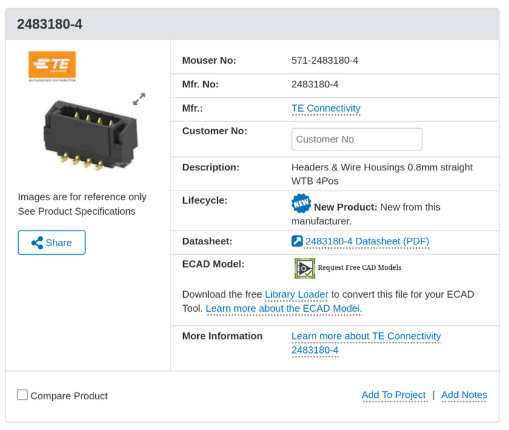
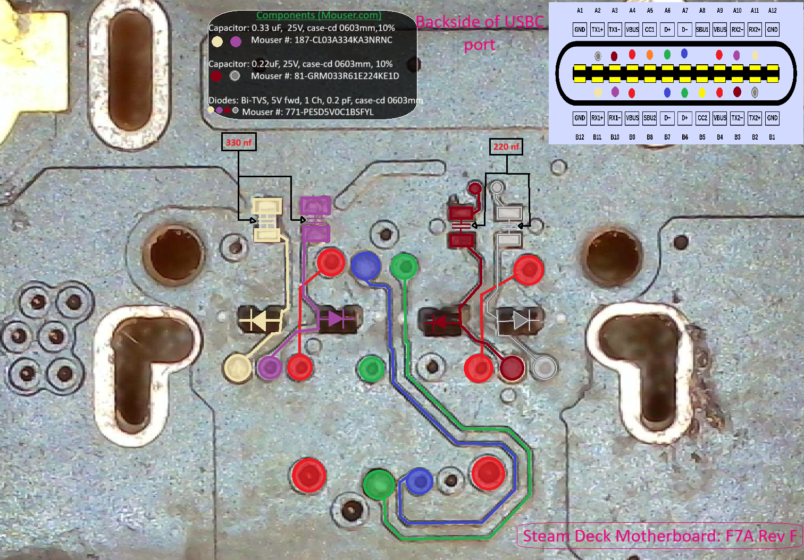
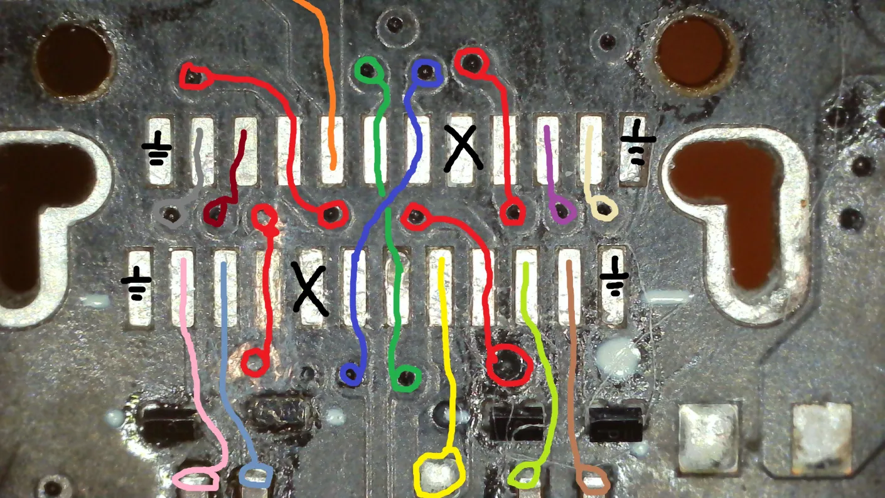
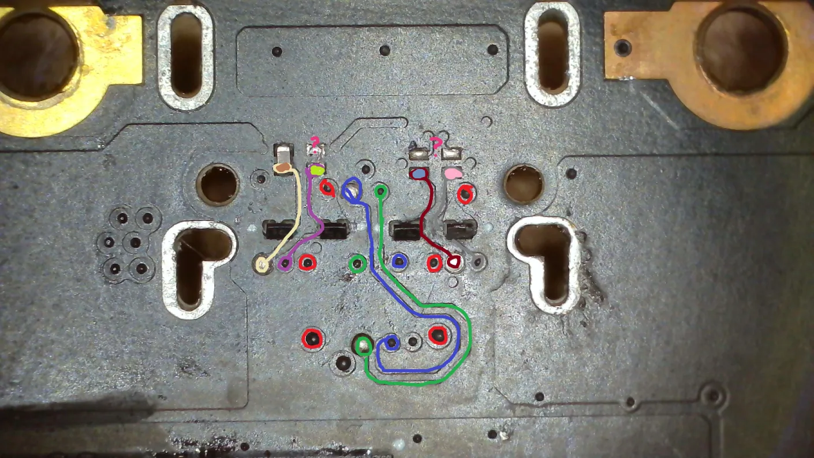
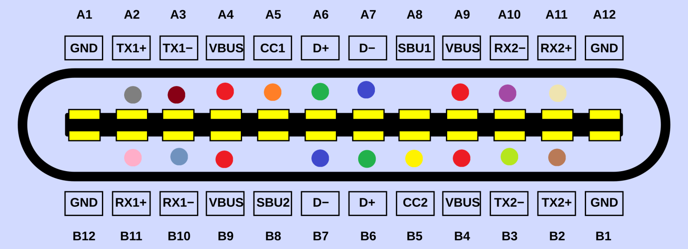

# Steam Deck LCD Parts And Measurements

## [Chip ID](https://www.ifixit.com/Guide/Steam+Deck+Chip+ID/147811)

## [Offical CAD Files](https://gitlab.steamos.cloud/SteamDeck/hardware)

## Main / Motherboard
- [USB-C Connector - 12402143E512A](https://www.amphenol-cs.com/product/12402143e512a.html)

### Different Revisions

### Panelization - [Explanation By PCBWay](https://www.pcbway.com/blog/PCB_Basic_Information/What_is_PCB_Panelization_PCB_Knowledge_eaf7e88f.html)

### Measurements

F7A Revision Pads  

The one above the APU should be roughly 2mm thick, 7.5mm wide and 11mm in length.  
Any of these measurements might not be perfect, give or take an extra 0.5mm.

### Diode Readings

### Traces

## Parts

### Joystick
- Uses PS5 pinouts
- Thumbstick cap is capacitive (that's what the wire that's soldered to the module is for)
- There are two Types (A or B)

#### Backside Of Right Joystick

#### Other Controllers' Pinouts ([Source (?)](https://www.reddit.com/r/ConsoleRepairUK/comments/18i6al8/ps5_ps4_xbox_hall_effect_analog_stick_pinout/))

### Fan Header

- [TE Connectivity 2483180-4](https://eu.mouser.com/ProductDetail/TE-Connectivity/2483180-4?qs=sGAEpiMZZMvlX3nhDDO4ADM3qnTU%252BbjxNmfJQeot/Po%3D)
- [Source: Valve Employee (u/SteamHWFeedBack)](https://www.reddit.com/r/SteamDeck/comments/1j0k1y0/comment/mfceils/)

### USB-C Port

#### Components
- Caps: .22u, 0201, 25V Rated (USB-3/DP may not work without them)
- Diodes: PESD5V0C1BSF
- Might be able to get away with missing ESD components but it's not recommended
- [Source: Valve Employee (u/SteamHWFeedBack)](https://www.reddit.com/r/SteamDeck/comments/1j0k1y0/comment/mfc7u68/)

- Additional pictures by Ayo_Gart:

#### Pinout

### Additional information
- [Different input / controller daughterboard revisions might not be "drop-in" replacements (firmware flashing might be needed)](https://www.reddit.com/r/SteamDeckModded/comments/1gcftli/can_i_really_use_a_rev_f_instead_of_another_rev_g/)